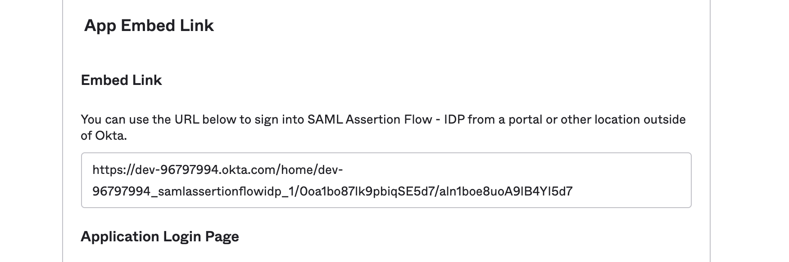
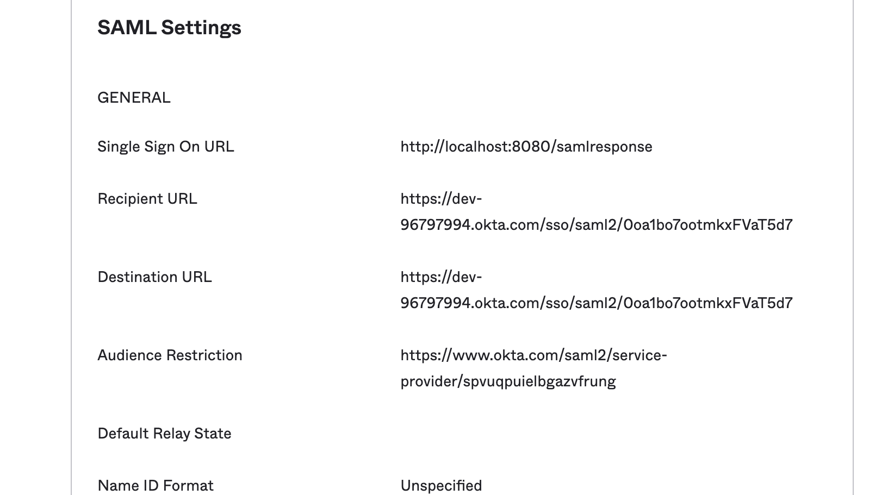
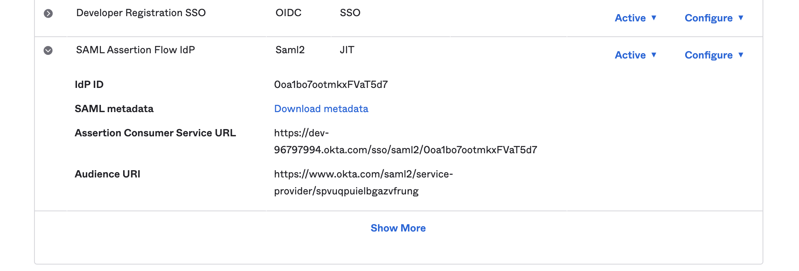
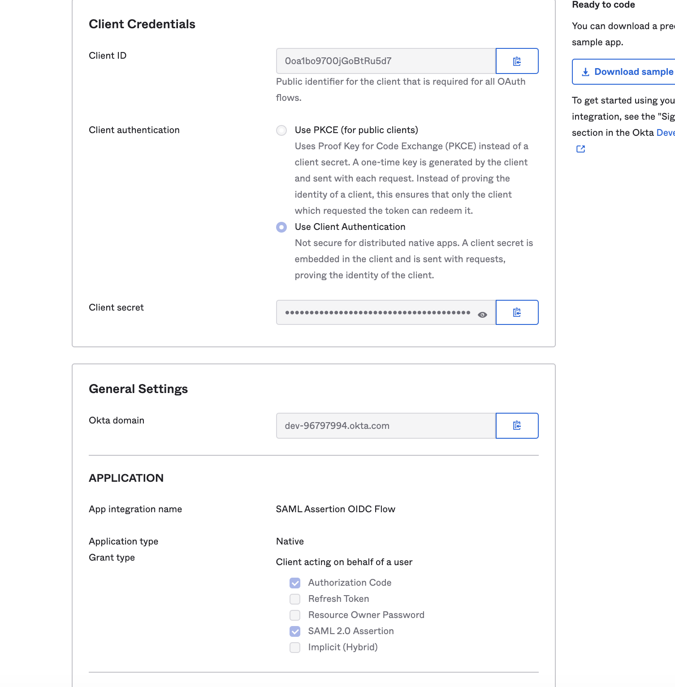

# Sample SAML Assertion Flow

This example shows how to use the [Okta SAML Assertion Flow](https://developer.okta.com/docs/guides/implement-saml2/overview/) to exchange an assertion for tokens.
The application uses the Okta Embed Link of a SAML Application to start an IdP Initiated flow. The SSO URL for the SAML application points to this application which will strip out the SAML Assertion, and then use it in a /token call to OKta.  

The application is already configured to use a preconfigured Okta Org. To view the configurations in Okta login to https://dev-96797994-admin.okta.com.  
Credentials  
Username: `read.only`  
Password: `Th1sPassword`  

Relevant Settings:
* Security -> Identity Providers -> SAML Assertion Flow IdP
* Applications -> Applications -> SAML Assertion Flow - IDP
* Applications -> Applications -> SAML Assertion OIDC Flow


### To Install
```
git clone https://github.com/emanor-okta/saml-assertion-flow-with-okta.git
cd saml-assertion-flow-with-okta
go mod tidy
```

### To Run
```
go run main.go
```  

Navigate to http://localhost:8080   
Click `Get Tokens` to start the flow.   
Use the same Credentials used to login to the Org, `read.only`/`Th1sPassword`  
    
     
     
## The Flow
1. **http://localhost:8080**
Clicking "Get Tokens" starts by redirecting to the SAML Application 'SAML Assertion Flow' by using the embedded URL    
`https://dev-96797994.okta.com/home/dev-96797994_samlassertionflowidp_1/0oa1bo87lk9pbiqSE5d7/aln1boe8uoA9lB4YI5d7`    
     
     
2. **SAML Assertion Flow - IDP** application starts an IdP initiated flow

The Destination and Recipient URLs are set for the SAML IdP setup in Okta. The **Single Sign On URL** is set to the application running on localhost so it can pull out the SAML Assertion from the SAML Response.
     
    
3. **http://localhost:8080/samlresponse** receives the SAML Response and extracts the SAML Assertion.
Uses the assertion to call the /token endpoint doing an SAML Assertion Flow `https://dev-96797994.okta.com/oauth2/default/v1/token`
     
4. **SAML Assertion OIDC Flow** application Verifies the SAML Assertion is valid via the Registered SAML IdP configured in Okta
     
5. **SAML Assertion Flow IdP** (Social SAML IdP) verifies the SAML Assertion is  valid
  
     
6. **SAML Assertion OIDC Flow** application returns tokens to the user application if the assertion was valid


